# Grounded Knowledge Workbench

[](https://github.com/NavidBroumandfar/grounded-knowledge-workbench/actions/workflows/ci.yml)
[](https://www.python.org/)
[](docs/RELEASE_EVIDENCE.md)
[](LICENSE)

A public-safe, local-first knowledge engineering workbench that treats evidence
and access policy as prerequisites for model output.



Solid teal represents behavior validated today. The dashed panel is the
explicit roadmap. The visual remains editable through the
[Mermaid source](diagrams/knowledge-workflow.mmd) or
[Excalidraw scene](diagrams/knowledge-workflow.excalidraw).

## What this validates

- A synthetic corpus packaged with the Python distribution.
- Deterministic manifest and required-provenance checks.
- Fail-closed handling for unknown roles and unsafe, missing, absolute,
  traversal, or symlink-escape paths.
- Role-filtered evidence selection before any future model call.
- A machine-readable CLI and an installable-wheel smoke test.
- Locked CI on Python 3.11, 3.12, and 3.13 using commit-pinned actions.

This is the deterministic foundation of the product. Retrieval, model-backed
synthesis, agent workflows, graph export, and document generation are planned,
not presented as implemented.

## Quick start

Prerequisites: Python 3.11 or newer and [`uv`](https://docs.astral.sh/uv/).

```bash
git clone https://github.com/NavidBroumandfar/grounded-knowledge-workbench.git
cd grounded-knowledge-workbench
uv sync --locked
uv run gkw status --json
uv run gkw access --role engineer --json
uv run python -m unittest discover -s tests -v
```

The status command returns evidence such as:

```json
{
  "delivery_stage": "deterministic_foundation",
  "document_count": 3,
  "maturity": "contract_ready",
  "roles": ["reader", "engineer", "reviewer"]
}
```

## Access behavior

The packaged corpus is fictional and designed to make the policy boundary easy
to inspect.

| Role | Allowed synthetic sources |
|---|---|
| `reader` | Operations overview |
| `engineer` | Operations overview and maintenance runbook |
| `reviewer` | All sources, including the review register |

Unknown roles and ambiguous paths return an error instead of widening access.

## Capability status

| Capability | Status |
|---|---|
| Python >=3.11 environment managed with `uv` | Validated |
| Synthetic corpus manifest and required provenance metadata | Validated |
| Fail-closed path validation and role filtering | Validated |
| Grounded retrieval and cited answers | Planned |
| Pluggable model adapter and bounded agent workflow | Planned |
| Knowledge bundle, graph export, and report generation | Planned |
| Evaluation suite, executable notebook, and operator material | Planned |

## Architecture and delivery

The workbench keeps deterministic policy outside model-owned behavior. Models
may eventually draft, classify, or critique, but they will not own access
decisions, provenance, approval state, or evidence serialization.

- [Product contract](PROJECT_CONTRACT.md) defines outcomes and boundaries.
- [Architecture](docs/ARCHITECTURE.md) documents components and failure policy.
- [Delivery roadmap](docs/DELIVERY_ROADMAP.md) orders work by evidence gates.
- [Release evidence](docs/RELEASE_EVIDENCE.md) records verification and limitations.

## Repository map

```text
diagrams/                        workflow source and rendered assets
docs/                            architecture, roadmap, ADRs, and evidence
notebooks/                       future executable walkthrough
src/grounded_knowledge_workbench deterministic core and packaged synthetic corpus
tests/                           policy and boundary tests
```

## Trust boundary

The repository is independently specified and uses only synthetic data. It
contains no employer, client, mailbox, transcript, contract, internal-project,
or controlled-distribution material.

The current role filter is a portfolio demonstration, not a production
authorization or identity system. See [SECURITY.md](SECURITY.md) for the
security boundary and private reporting route.

## Contributing

Focused contributions are welcome when they preserve deterministic policy,
claim accuracy, and the synthetic-data boundary. Start with
[CONTRIBUTING.md](CONTRIBUTING.md).
